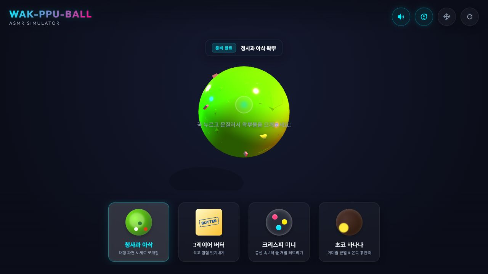

# WAK-PPU-BALL ASMR Simulator

브라우저에서 왁뿌볼을 누르고 문질러 깨뜨리는 모바일 대응 3D ASMR 시뮬레이터입니다.



## 바로 실행

[GitHub Pages에서 플레이하기](https://apple77771.github.io/wakppuball-simulator/)

화면의 왁뿌볼을 길게 누르거나 드래그해 상호작용할 수 있습니다. 하단 카드에서 재질을 변경하고, 우측 상단 버튼으로 음향·진동·냉동 효과와 초기화를 제어합니다.

## 주요 기능

- Three.js 기반 실시간 3D 렌더링
- 마우스와 터치 입력 지원
- 재질별 변형·균열·파편 효과
- Web Audio 기반 상호작용 음향
- 모바일 화면과 진동 피드백 대응

## 로컬 실행

Node.js가 설치된 환경에서 다음 명령을 실행한 뒤 `http://localhost:8080`을 엽니다.

```bash
node server.js
```

별도의 빌드 과정이나 패키지 설치는 필요하지 않습니다.

## 배포

GitHub Pages가 `main` 브랜치의 루트 디렉터리를 배포합니다. `main`에 반영된 변경 사항은 별도의 빌드 과정 없이 공개 사이트에 배포됩니다.

## 기술 구성

- HTML, CSS, JavaScript
- [Three.js r128](https://github.com/mrdoob/three.js/tree/r128)
- Google Fonts

## 피드백과 기여

버그와 개선 의견은 [GitHub Issues](https://github.com/apple77771/wakppuball-simulator/issues)에 남겨주세요. 재현 환경과 절차를 포함하면 확인이 빨라집니다. 코드 기여 방법은 [CONTRIBUTING.md](CONTRIBUTING.md)를 참고하세요.

## 권리와 라이선스

소스 코드는 [MIT License](LICENSE)로 배포합니다. `audio/`의 효과음은 프로젝트 관리자가 직접 녹음했으며 [CC BY 4.0](audio/LICENSE.md)으로 제공합니다. 외부에서 불러오는 Three.js와 Google Fonts에는 각 프로젝트의 라이선스가 적용됩니다.
